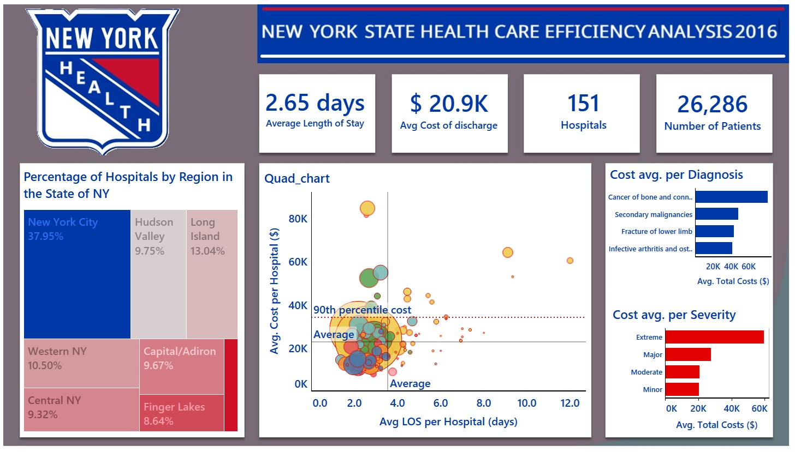
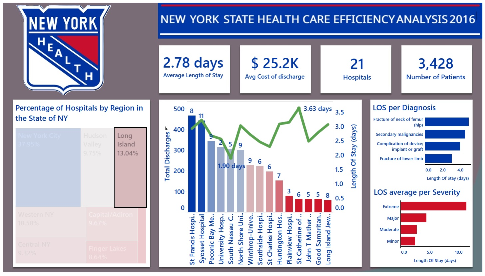

# Healthcare Efficiency Analysis in Tableau

This project provides an in-depth analysis of hospital efficiency in New York state based on data from 2016. The focus is on the efficiency of hospitals performing elective hip replacement surgeries, particularly examining the **Length of Stay (LOS)** and **total discharge costs**.

## Project Overview

Using a dataset of **151 hospitals** in New York from 2016, this analysis explores the following:
- **Average Length of Stay (LOS)**
- **Average Cost of Discharge**
- **Factors influencing LOS and costs**
- **Regional differences in hospital performance**

The final goal is to identify performance outliers, benchmark hospitals, and uncover key insights that can help improve healthcare efficiency.

### Key Metrics:
- **Average Length of Stay (LOS)**
- **Average Cost per Discharge**
- **Number of Hospitals**
- **Number of Patients Discharged**

## Insights & Results

1. **Regional Distribution of Hospitals**: The dashboard shows the percentage of hospitals in different regions of New York, with New York City having the highest concentration (37.95%).

2. **Hospital Benchmarking**: Hospitals are benchmarked based on their average LOS and cost per discharge, with significant variation across different hospitals.

3. **LOS by Diagnosis & Severity**: The analysis identifies which diagnoses and patient severities lead to longer hospital stays. For example, **hip fracture patients** tend to have a higher LOS compared to those with secondary malignancies.

4. **Cost Analysis**: A breakdown of costs by diagnosis and patient severity is provided, highlighting significant cost differences across hospitals and patient conditions.

### Dashboard Visuals:
The two dashboards below summarise key performance indicators, providing an interactive view of the data.

#### Dashboard 1: Hospital Efficiency Metrics

#### Dashboard 2: Cost vs. Length of Stay (highlighting Long Island statistics)

For the full interactive story and dashboards, visit my Tableau Public profile:

[Visit Tableau Public Profile](https://public.tableau.com/shared/4DWKJ5MJZ?:display_count=n&:origin=viz_share_link)

## Conclusion

This Tableau analysis helps visualize hospital efficiency by identifying outliers, patterns in patient outcomes, and cost structures across different regions and hospital types. By understanding these factors, hospitals can optimise operations, reduce unnecessary costs, and improve patient care.

## Files & Resources
- Tableau workbook for interactive visualisation.
- Dataset and metadata for further exploration and analysis.

---

Feel free to explore the dashboards and dig deeper into the insights!
